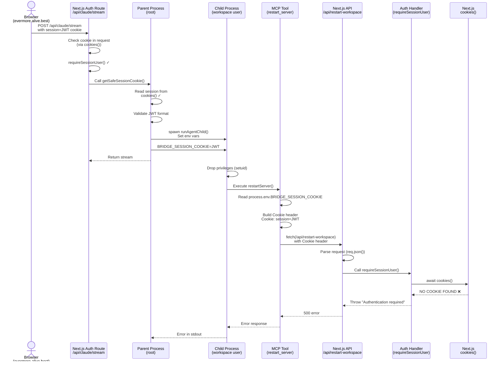

# MCP Tool Authentication Flow

**Status:** ✅ FIXED - Shared constants package created
**Date:** 2025-11-21
**Fixed:** 2025-11-21
**Context:** Investigation and fix of `restart_dev_server` tool authentication failures

---

## Overview

This diagram shows the complete authentication flow when an MCP tool (like `restart_dev_server`) calls back to the Bridge API. It traces how the session cookie is passed from the initial user request through the child process to the final API authentication.

---

## Sequence Diagram



---

## Authentication Flow Steps

### 1. Initial Request (Browser → API)
- User makes request from browser with `Cookie: auth_session=JWT`
- Next.js route receives request and validates session via `cookies()`
- User is successfully authenticated

### 2. Session Cookie Extraction
- Route calls `getSafeSessionCookie()` to get JWT value
- JWT is validated and passed to child process runner

### 3. Child Process Spawn
- Parent process (running as root) spawns child with environment variables
- Sets `BRIDGE_SESSION_COOKIE=JWT` in child environment
- Child process drops privileges to workspace user (setuid/setgid)

### 4. MCP Tool Execution
- SDK executes `restart_dev_server` tool
- Tool reads `process.env.BRIDGE_SESSION_COOKIE`
- Calls `callBridgeApi()` to make HTTP request

### 5. HTTP Request Construction (⚠️ BUG HERE)
- Bridge API client builds Cookie header
- **Current behavior:** `Cookie: session=JWT` (WRONG)
- **Expected behavior:** `Cookie: auth_session=JWT` (CORRECT)

### 6. API Authentication (❌ FAILS)
- API route receives request with Cookie header
- Calls `requireSessionUser()` → `getSessionUser()`
- `cookies()` parses header, looks for cookie named `auth_session`
- Finds cookie named `session` instead → returns null
- Throws "Authentication required"

---

## Root Cause

**Cookie Name Mismatch:**
- **Sent:** `Cookie: session=JWT`
- **Expected:** `Cookie: auth_session=JWT`

**Location of Bug:**
```typescript
// packages/tools/src/lib/bridge-api-client.ts line 62
...(sessionCookie && { Cookie: `session=${sessionCookie}` })
//                              ^^^^^^^ HARDCODED WRONG NAME
```

**Why This Happens:**
1. Browser cookies use name `auth_session` (defined in `COOKIE_NAMES.SESSION`)
2. Child process receives raw JWT value (not the cookie name)
3. Bridge API client reconstructs header with hardcoded name `session`
4. API expects `auth_session` but receives `session`

---

## The Fix (✅ IMPLEMENTED)

### Solution: Create Shared Constants Package

Created `packages/shared` to serve as single source of truth for cookie names and other shared constants.

**Step 1: Create Shared Package**
```typescript
// packages/shared/src/constants.ts
export const COOKIE_NAMES = {
  SESSION: "auth_session",
  MANAGER_SESSION: "manager_session",
} as const
```

**Step 2: Update apps/web**
```typescript
// apps/web/lib/auth/cookies.ts
import { COOKIE_NAMES, SESSION_MAX_AGE } from "@webalive/shared"

// Re-export for backward compatibility
export { COOKIE_NAMES, SESSION_MAX_AGE }
```

**Step 3: Update packages/tools**
```typescript
// packages/tools/src/lib/bridge-api-client.ts
import { COOKIE_NAMES } from "@webalive/shared"

const response = await fetch(apiUrl, {
  headers: {
    "Content-Type": "application/json",
    ...(sessionCookie && { Cookie: `${COOKIE_NAMES.SESSION}=${sessionCookie}` }),
  },
})
```

**Benefits:**
- No hardcoded values
- Single source of truth
- Type-safe imports
- No circular dependencies
- Prevents future regressions

---

## Files Involved

### Authentication Chain
1. `apps/web/app/api/claude/stream/route.ts` - Initial authentication
2. `apps/web/features/auth/lib/auth.ts` - `getSafeSessionCookie()`, `requireSessionUser()`
3. `apps/web/lib/auth/cookies.ts` - `COOKIE_NAMES.SESSION` constant
4. `apps/web/lib/workspace-execution/agent-child-runner.ts` - Spawn child with env vars
5. `apps/web/scripts/run-agent.mjs` - Child process, drops privileges
6. `packages/tools/src/lib/bridge-api-client.ts` - **BUG LOCATION** - reconstructs cookie header
7. `packages/tools/src/tools/workspace/restart-server.ts` - MCP tool entry point
8. `apps/web/app/api/restart-workspace/route.ts` - API endpoint
9. `apps/web/lib/workspace-api-handler.ts` - API auth wrapper

### Cookie Name Definition
- Single source of truth: `apps/web/lib/auth/cookies.ts`
- Value: `COOKIE_NAMES.SESSION = "auth_session"`

---

## Testing After Fix

```bash
# 1. Apply fix to both files
# 2. Rebuild tools package
bun run build

# 3. Restart dev/staging
make dev  # or make staging

# 4. Test with user: admin@example.com on evermore.alive.best
# 5. Trigger restart_dev_server tool
# 6. Should succeed without "Authentication required" error
```

---

## Related Issues

- **Security vulnerability fixed:** Path traversal in workspace authorization (Nov 11, 2025)
- **Environment variable sanitization:** BUN_INSTALL_CACHE_DIR after setuid (Nov 12, 2025)

---

## References

- Cookie configuration: `apps/web/lib/auth/cookies.ts`
- Session management: `apps/web/features/auth/lib/auth.ts`
- Workspace API security: `docs/problems/workspace-authorization-bypass-nov-11-2025.md`
