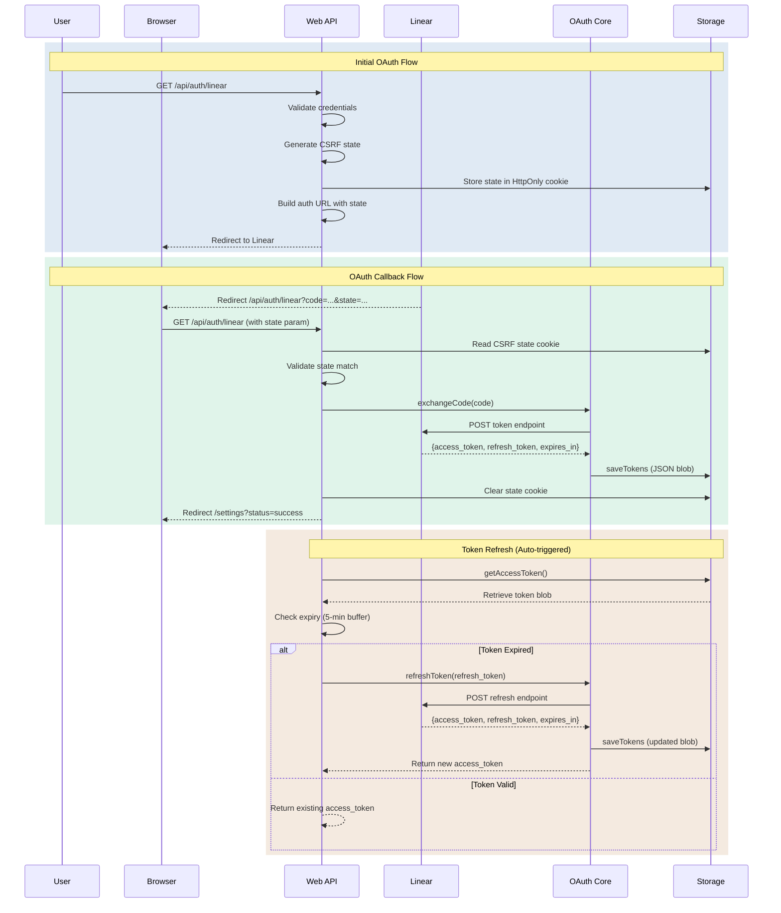
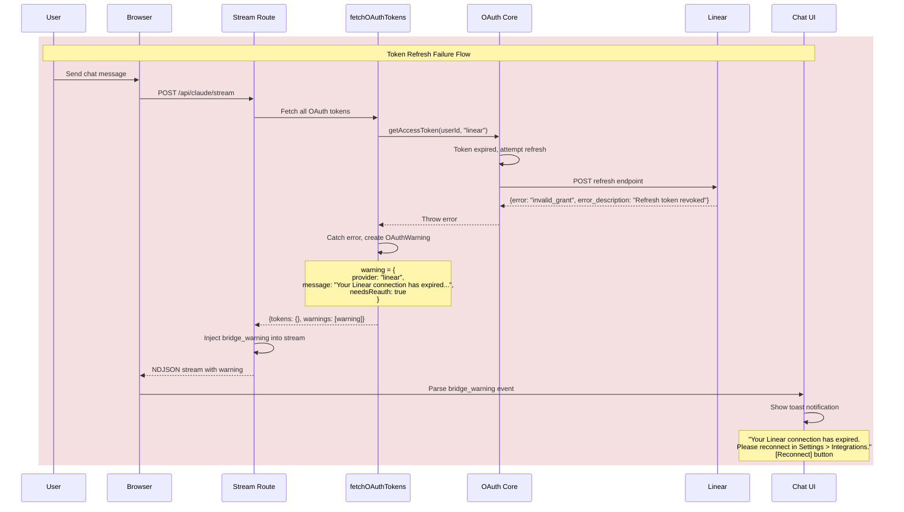

# Linear OAuth Flow - Sequence Diagrams

This document contains sequence diagrams illustrating the Linear OAuth integration flow in Claude Bridge.

## Overview

The Linear OAuth integration uses a four-phase flow:
1. **Initial OAuth Flow**: User initiates authorization, state is validated via CSRF tokens
2. **OAuth Callback Flow**: Linear redirects back with code, tokens are exchanged and stored
3. **Token Refresh Flow**: Automatic token refresh when access token expires (with 5-min buffer)
4. **Refresh Failure Flow**: Warning injection when refresh fails (revoked/invalid tokens)

## Architecture Components

- **Web API**: Next.js API routes (`/api/auth/linear`, `/api/integrations/linear`)
- **OAuth Core**: `@webalive/oauth-core` package handling token exchange/refresh
- **Storage**: Supabase database with AES-256-GCM encrypted token storage
- **Linear**: Linear API OAuth2 endpoints

## Sequence Diagrams

### Complete OAuth Flow



## Phase 1: Initial OAuth Flow

**Entry Point**: User clicks "Connect Linear" in Settings Modal

**Steps**:
1. Frontend sends `GET /api/auth/linear`
2. Backend validates user authentication
3. Backend generates cryptographically secure CSRF state token
4. State token stored in HttpOnly cookie (security: prevents XSS)
5. Authorization URL built with state parameter
6. User redirected to Linear's OAuth consent page

**Security Measures**:
- CSRF state token (prevents request forgery)
- HttpOnly cookie (prevents JavaScript access)
- State validation on callback

## Phase 2: OAuth Callback Flow

**Entry Point**: Linear redirects back to `/api/auth/linear?code=CODE&state=STATE`

**Steps**:
1. Backend reads state cookie
2. Backend validates state parameter matches cookie (CSRF protection)
3. Backend calls `OAuth Core` to exchange authorization code for tokens
4. OAuth Core posts to Linear's token endpoint
5. Linear returns `{access_token, refresh_token, expires_in}`
6. OAuth Core encrypts tokens (AES-256-GCM) and stores in Supabase
7. State cookie cleared
8. User redirected to `/settings?status=success`

**Error Handling**:
- State mismatch → 400 Bad Request
- Token exchange failure → 500 Internal Error
- Missing code/state → 400 Bad Request

## Phase 3: Token Refresh Flow

**Trigger**: Automatic when access token is about to expire (5-min buffer)

**Steps**:
1. API route calls `getAccessToken()`
2. Storage retrieves encrypted token blob
3. Token expiry checked (current time + 5 minutes)
4. If expired:
   - OAuth Core calls Linear's refresh endpoint with refresh_token
   - Linear returns new access_token, refresh_token, expires_in
   - OAuth Core encrypts and saves updated tokens
   - New access_token returned
5. If valid: existing access_token returned

**Security Measures**:
- Tokens encrypted at rest (AES-256-GCM)
- Refresh tokens rotated on each refresh (best practice)
- 5-minute buffer prevents race conditions

## Phase 4: Refresh Failure & Warning Flow

**Trigger**: Token refresh fails due to revocation or invalid_grant error



**Steps**:
1. User sends chat message, triggering stream route
2. Stream route calls `fetchOAuthTokens()` to get all provider tokens
3. OAuth Core attempts to refresh expired Linear token
4. Linear returns `invalid_grant` error (token revoked by user or expired)
5. `fetchOAuthTokens` catches error, creates `OAuthWarning` object
6. Warning returned alongside any successful tokens
7. Stream route injects `bridge_warning` synthetic message into NDJSON stream
8. Chat UI parses warning, displays toast with "Reconnect" action button

**Error Detection**:
- `invalid_grant` → Token revoked by user in Linear settings
- `revoked` → Token explicitly revoked
- `expired` / `refresh` → Refresh token expired (rare, ~30 days)

**Warning Types** (from `@webalive/shared`):

```typescript
// Warning from token fetch
interface OAuthWarning {
  provider: OAuthMcpProviderKey  // "linear" | "stripe"
  message: string                 // Human-readable message
  needsReauth: boolean           // Always true for these errors
}

// Content injected into stream
interface OAuthWarningContent {
  category: "oauth" | "general"
  provider?: OAuthMcpProviderKey
  message: string
  action?: string      // "Reconnect"
  actionUrl?: string   // "/settings?tab=integrations"
}
```

**User Recovery**:
1. User sees toast notification in chat
2. Clicks "Reconnect" button
3. Redirected to Settings > Integrations
4. Clicks "Connect" on Linear integration
5. Completes OAuth flow (Phase 1 & 2)
6. New tokens stored, future requests work

## Implementation Files

- **Web API Routes**:
  - `apps/web/app/api/auth/linear/route.ts` (OAuth initiation + callback)
  - `apps/web/app/api/integrations/linear/route.ts` (API proxy with auto-refresh)
  - `apps/web/app/api/claude/stream/route.ts` (Stream route with warning injection)

- **OAuth Core Package**:
  - `packages/oauth-core/src/providers/linear.ts` (LinearProvider class)
  - `packages/oauth-core/src/core/BaseOAuthProvider.ts` (Base class with token management)

- **Warning Flow**:
  - `packages/shared/src/oauth-warnings.ts` (Shared types: OAuthWarning, OAuthWarningContent)
  - `apps/web/lib/oauth/fetch-oauth-tokens.ts` (Token fetcher with warning collection)
  - `apps/web/lib/stream/ndjson-stream-handler.ts` (Warning injection into stream)
  - `apps/web/features/chat/lib/streaming/ndjson.ts` (BridgeWarningContent, isWarningMessage)
  - `apps/web/app/chat/page.tsx` (Toast display for warnings)

- **Storage**:
  - Supabase table: `iam.oauth_tokens` (tenant_id, provider, encrypted_tokens)

## Security Considerations

1. **CSRF Protection**: State parameter prevents cross-site request forgery
2. **Token Encryption**: AES-256-GCM encryption for tokens at rest
3. **HttpOnly Cookies**: State stored in HttpOnly cookie (XSS protection)
4. **Token Rotation**: Refresh tokens rotated on each refresh
5. **Expiry Buffer**: 5-minute buffer prevents token expiry during requests
6. **Tenant Isolation**: Tokens scoped to tenant (multi-tenant safe)

## Testing

See `apps/web/features/deployment/__tests__/deployment-api-security.test.ts` for security tests covering:
- CSRF state validation
- Token exchange flow
- Error handling

## Related Documentation

- [OAuth Core Package README](../../../packages/oauth-core/README.md)
- [Linear Integration Tests](../../../apps/web/features/deployment/__tests__/deployment-api-security.test.ts)
- [Multi-Tenant OAuth Guide](../../features/oauth-integration.md)
