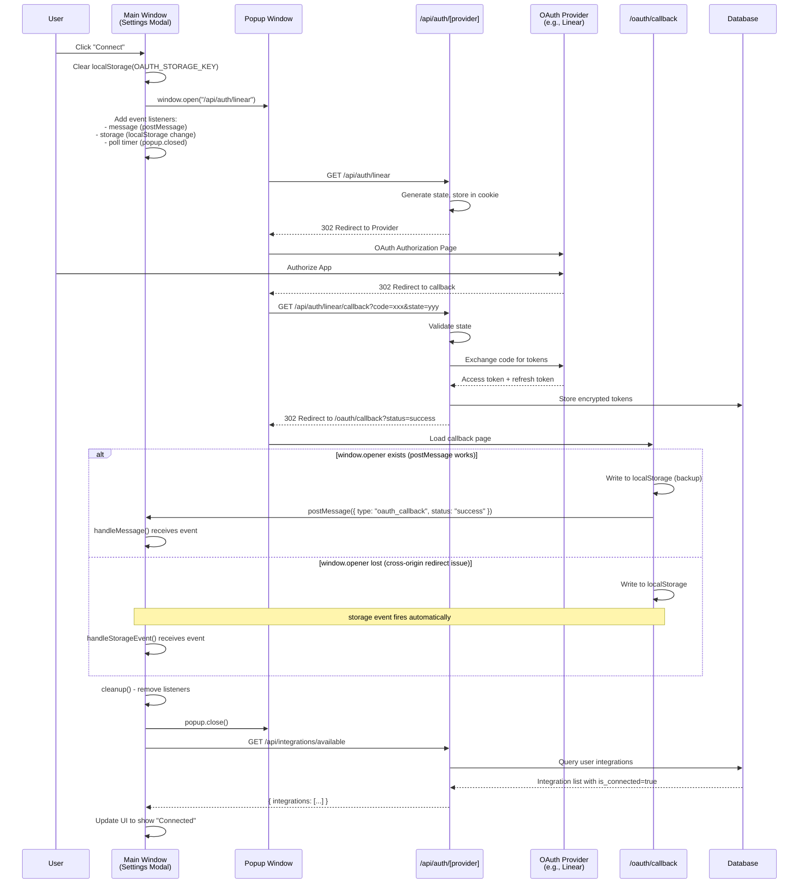

# OAuth Popup Flow

This document describes the popup-based OAuth flow used for integrations (e.g., Linear, GitHub).

## Overview

The flow uses a popup window for OAuth to keep the user in the settings modal. It has two communication mechanisms:
1. **postMessage** (primary) - Direct window-to-window communication
2. **storage event** (fallback) - For when `window.opener` is lost during cross-origin redirects

## Sequence Diagram



## Communication Mechanisms

### 1. postMessage (Primary)

```typescript
// Callback page posts to opener
window.opener.postMessage({
  type: "oauth_callback",
  integration: "linear",
  status: "success"
}, window.location.origin)

// Main window listens
window.addEventListener("message", (event) => {
  if (event.origin !== window.location.origin) return
  if (isOAuthCallbackMessage(event.data)) {
    // Handle success/error
  }
})
```

### 2. storage event (Fallback)

When the popup navigates to a different origin (the OAuth provider) and back, `window.opener` can be nulled out by the browser for security. The storage event provides a fallback:

```typescript
// Callback page writes to localStorage
localStorage.setItem("oauth_callback_result", JSON.stringify({
  type: "oauth_callback",
  integration: "linear",
  status: "success"
}))

// Main window listens for storage changes from other windows
window.addEventListener("storage", (event) => {
  if (event.key === "oauth_callback_result" && event.newValue) {
    const data = JSON.parse(event.newValue)
    // Handle success/error
  }
})
```

### 3. Polling (Popup Closure Detection)

We still poll to detect if the user manually closes the popup:

```typescript
const pollTimer = setInterval(() => {
  if (popup.closed) {
    // Check localStorage one more time, then resolve as cancelled
  }
}, 500)
```

## Files Involved

| File | Purpose |
|------|---------|
| `hooks/use-integrations.ts` | `openOAuthPopup()` - Opens popup, handles all communication |
| `app/oauth/callback/page.tsx` | Receives OAuth result, posts to opener + localStorage |
| `lib/oauth/popup-constants.ts` | Shared constants and type guards |
| `app/api/auth/[provider]/route.ts` | Initiates OAuth, handles callback |
| `lib/oauth/oauth-flow-handler.ts` | Token exchange and storage |

## Error Handling

| Scenario | Result |
|----------|--------|
| Popup blocked | Falls back to full-page redirect |
| User closes popup | "Authorization cancelled" error |
| OAuth denied | Error message from provider shown |
| Token exchange fails | Error message shown |
| `window.opener` lost | storage event fallback kicks in |

## Security Considerations

1. **Origin validation**: postMessage checks `event.origin`
2. **State parameter**: CSRF protection via state cookie
3. **Token encryption**: Tokens stored with AES-256-GCM in database
4. **localStorage cleanup**: Cleared after reading to prevent replay
